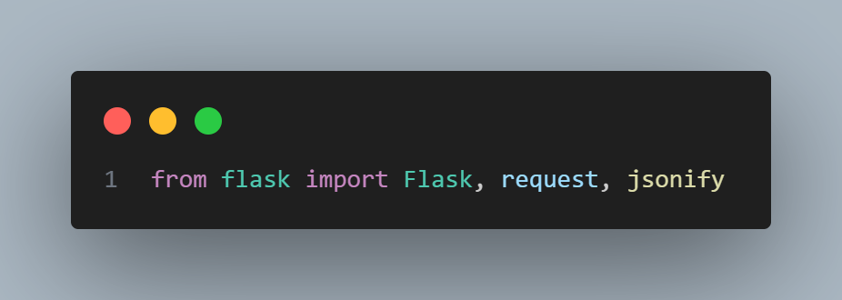

# 📦 Finenice Backend API

Backend untuk aplikasi Finenice — sistem manajemen produk dan transaksi menggunakan Flask, JWT, dan MySQL.

---

## 🚀 Cara Menjalankan

```bash
# Clone repo
git clone https://github.com/MaulanaNur12/finenice-app.git
cd finenice-app/backend

# Install dependencies
pip install -r requirements.txt

# Jalankan server
python app.py

backend/
├── app.py                # Main Flask App
├── models.py             # Koneksi ke database & inisialisasi
├── requirements.txt      # Daftar dependensi Python
├── Dockerfile            # instruksi untuk membuat image Docker
├── finenice-backend.yaml # digunakan untuk mendefinisikan Deployment dan Service di Kubernetes agar backend
└── README.md             # Dokumentasi backend ini

1. app.py 
a Flask

